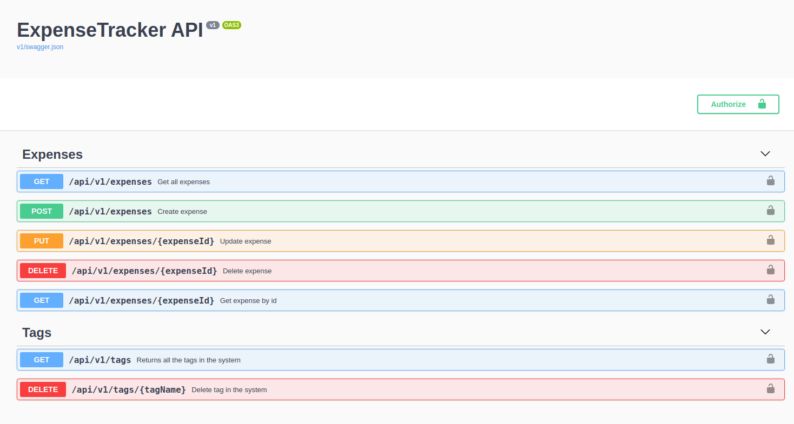
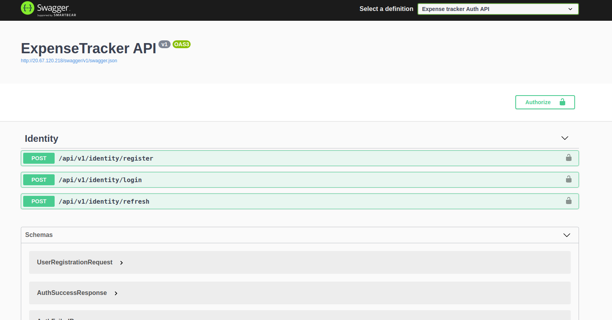

#  ExpenseTracker API
This project is an expense tracking RESTful API service that allows users to create expenses with tag related to them. 

Project has two microservices: Main Api and Auth Api. Project was build for learning purposes.
## Swagger documentation
Api documentations:
* Main api - https://app.swaggerhub.com/apis/Lavinski4/Expense_Tracker_API/v1#/
* Auth api - https://app.swaggerhub.com/apis/Lavinski4/Expense_Tracker_Auth_API/v1

_P.S. Documentations were automatically generated and then uploaded to swaggerhub for offline use_

## Project technologies:
* JWT tokens
* Refresh tokens
* Docker
* Kubernetes
* Redis (Caching)
* Unit testing
* Integration testing
* Continues testing
* Swagger

